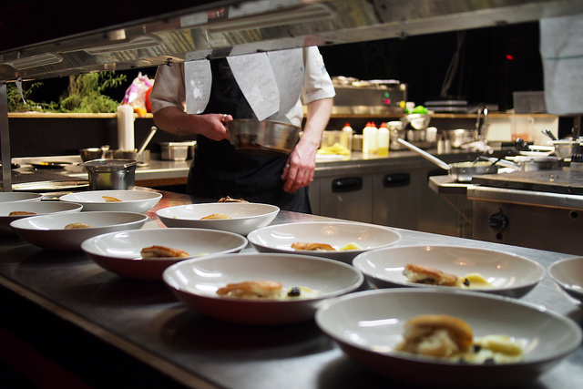

how web apps work
---
database (stores information)
---

---
app i.e. rails (gets it ready)
---

---
front end (serves it)
---

---
CRUD
---
* create
* read
* update
* destroy
---
all data comes from users ...
---
no going to grocery store, just use what's in your pantry
---
APIs
---
apps share data between their kitchens
---
Creative Commons photo attribution:

freezer -- opengridscheduler on Flickr
https://www.flickr.com/photos/opengridscheduler/23293476073

kitchen -- Franklin Heijnen on Flickr
https://www.flickr.com/photos/franklinheijnen/25059038532

waiter -- Sarah Stierch on Flickr
https://www.flickr.com/photos/sarahvain/35221341092

