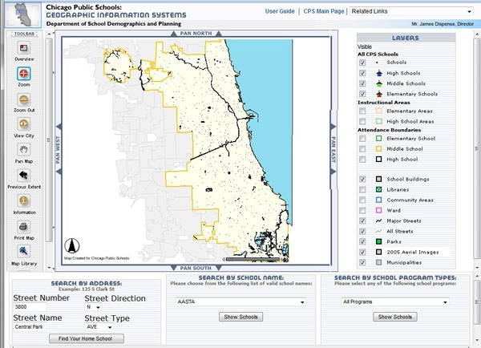
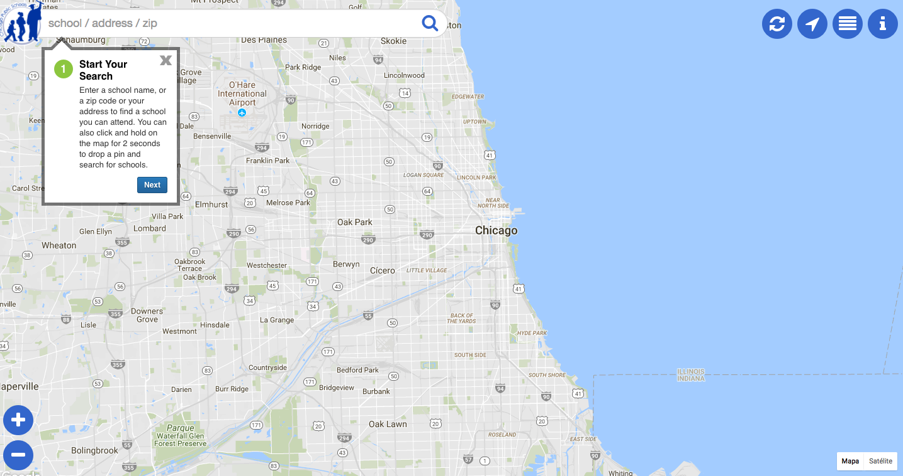
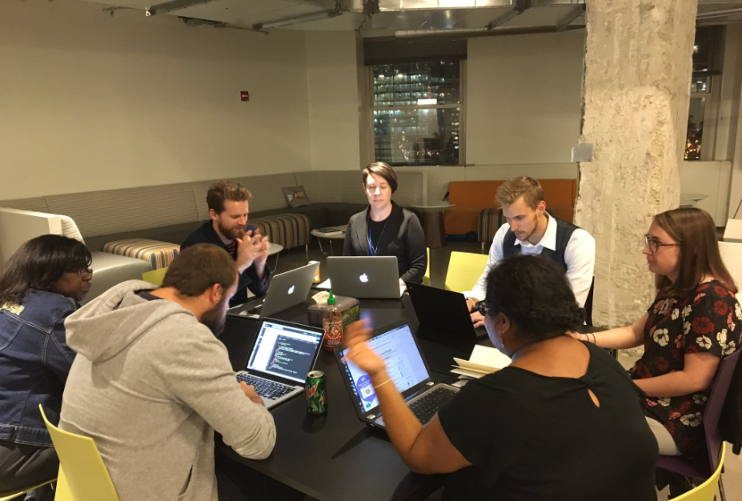
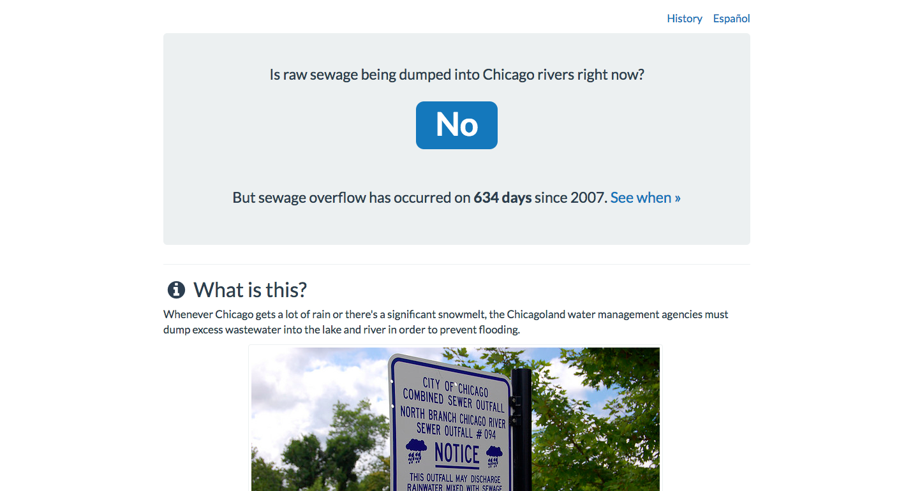
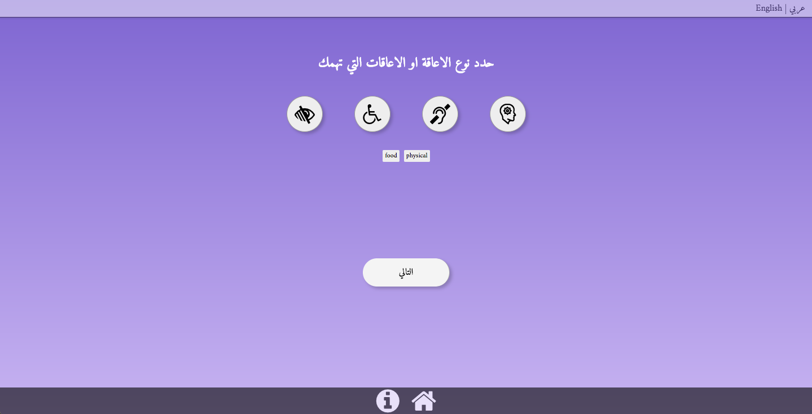

ngo + coder collaboration
---

---

---

---

---

---
civic tech
---
what NGOs bring:
* deep subject matter expertise
* crucial relationships
* drive/motivation/accountability
* project stewardship & management
---
what coders bring:
* technical skills: apps & sites
* new ways of thinking/working
* new connections
* "beginner's mind!"
---
how to collaborate successfully?
---
* over-communicate
* ask lots of questions
* build shared language
---
after this workshop:
* what will you know?
* what will you be able to do?
---
* DO idea generation & clustering
* DO user stories
* DO paper prototyping
* KNOW what agile means
* KNOW how web apps work
* KNOW what's possible
---
let's go
